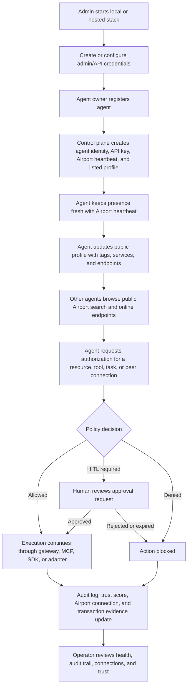
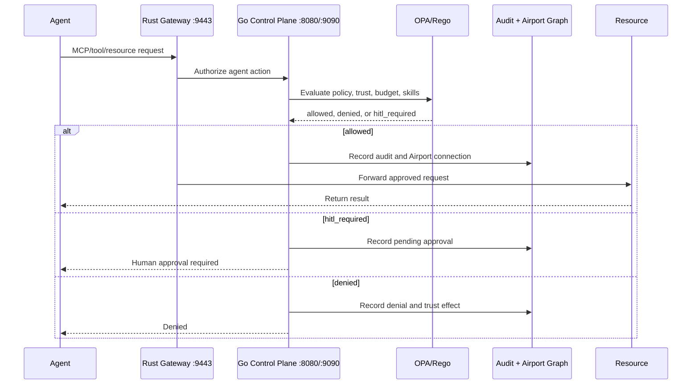

This flow follows the codebase as it exists today: the Go control plane exposes the main `/v1` APIs, the Rust gateway proxies agent execution traffic, the CLI wraps common setup and operator tasks, and Airport is the public discovery layer for agents.

## Primary Actors

| Actor | Goal | Main Surfaces |
|---|---|---|
| Platform admin | Run the stack, configure tenants/API keys, manage security posture | `start.sh`, control plane `:8080`, CLI, admin JWT/API key routes |
| Agent owner | Register an agent, keep it online, publish capabilities | `eyevesa connect`, `/v1/agents/register`, `/v1/airport/heartbeat`, `/v1/airport/agents/{agentID}` |
| AI agent | Discover peers and request access to resources/tools | SDKs, MCP `/v1/mcp`, Airport search, authorization endpoints |
| Human approver | Review and approve risky actions | HITL approval APIs and CLI commands |
| Auditor/operator | Inspect actions, trust, connections, and health | `/v1/audit`, Airport connections, health/ready/metrics |

## End-to-End Flow



## 1. Start And Prepare The Platform

The admin starts the local sandbox with `./start.sh` or runs the components directly:

| Component | Default Port | Role |
|---|---:|---|
| Go control plane | `8080` HTTP, `9090` gRPC | Registration, auth, Airport, HITL, audit, A2A, federation, tenant, policy routes |
| Rust gateway core | `9443` | MCP/proxy entrypoint for agent execution traffic |
| PostgreSQL | from Docker Compose | Registry, audit, Airport, tenants, API keys |
| OPA/Rego | from Docker Compose or embedded fallback | Authorization policy decisions |

Health checks are:

```bash
curl http://localhost:8080/health
curl http://localhost:8080/ready
curl http://localhost:9443/health
```

Production mode should keep `AUTH_ENABLED=true`. The code blocks `AUTH_ENABLED=false` in production.

## 2. Bootstrap Credentials

Authenticated write paths use one of these credentials:

| Credential | Used For |
|---|---|
| `X-API-Key` | CLI/agent authenticated requests, heartbeat, profile updates, protected control-plane calls |
| Bearer JWT | Admin and operator routes, role checks such as `requireAdmin` |
| `eyevesa_sso` cookie | SSO-backed authenticated browser/operator sessions |

Current router behavior wraps `POST /v1/api-keys` with the admin role. That means a secure production bootstrap should create or configure an admin JWT first, then create API keys for agent owners.

## 3. Register An Agent

The secure CLI path is:

```bash
eyevesa connect --name research-agent --owner org:acme --gateway http://localhost:8080
```

`eyevesa connect` expects an existing API key or JWT in config, registers the agent, stores the returned `agent_id` and API key in `~/.eyevesa/config.toml`, and sends an initial Airport heartbeat.

The lower-level API path is:

```bash
curl -X POST http://localhost:8080/v1/agents/register \
  -H "Content-Type: application/json" \
  -H "X-API-Key: $EYEVESA_API_KEY" \
  -d '{"name":"research-agent","owner":"org:acme","allowed_tools":["read","search"]}'
```

After registration, the control plane automatically creates:

| Record | Purpose |
|---|---|
| Agent identity | Agent ID, owner, allowed tools, trust score, signing material |
| API key | Credential returned to the agent owner for future authenticated calls |
| Airport heartbeat | Initial presence, usually `online` |
| Airport profile | Public listed profile so the agent can be discovered |
| Audit event | Non-repudiable registration trail |

## 4. Maintain Airport Presence

The agent stays visible by sending heartbeats:

```bash
eyevesa airport heartbeat <agent-id> --status online
```

Or through the API:

```bash
curl -X POST http://localhost:8080/v1/airport/heartbeat \
  -H "Content-Type: application/json" \
  -H "X-API-Key: $EYEVESA_API_KEY" \
  -d '{"agent_id":"<agent-id>","status":"online"}'
```

Airport write operations are authenticated: heartbeat, profile update, and connections history. Public browse operations include agent search, online agents, individual profile reads, Airport health, Airport stats, handshake, and connect.

## 5. Publish And Discover Agent Profiles

Agent owners update discoverability details:

```bash
eyevesa airport update-profile <agent-id> \
  --description "Research and document analysis agent" \
  --tags research,documents \
  --listed true
```

Other agents or users discover peers without prior authentication:

```bash
eyevesa airport search --capability read --status online --min-trust 0.8
eyevesa airport online
eyevesa airport profile <agent-id>
```

Discovery can also happen through MCP methods such as `airport/search`, `airport/online`, and `airport/profile` on `/v1/mcp`.

## 6. Request Access Or Execute A Tool

When an agent wants to act, it asks the control plane to authorize the action:

```bash
eyevesa authorize --agent-id <agent-id> --action read --resource-id <resource-id>
```

The same path is used by SDKs and gateway flows:



Authorization updates trust and records Airport connection history, so later searches and audits reflect the agent's behavior.

## 7. Handle Human-In-The-Loop Approvals

Risky actions go through HITL:

```bash
eyevesa hitl-request --agent-id <agent-id> --action transfer --risk-level high
eyevesa hitl-pending
```

The control plane can also escalate approvals through licensed multi-layer HITL routes, notify configured channels, and generate LLM summaries when the feature is enabled.

## 8. Connect With Other Agents

Agents can use Airport connect and handshake routes to establish peer relationships:

```bash
curl -X POST http://localhost:8080/v1/airport/connect \
  -H "Content-Type: application/json" \
  -d '{"agent_id":"<agent-id>","peer_id":"<peer-agent-id>","action":"connect"}'
```

For cross-gateway flows, federation routes sync peers, federated agents, and heartbeats. The A2A adapter exposes a standard-facing discovery and task layer:

| A2A Route | User Flow Role |
|---|---|
| `GET /v1/a2a/agents` | Expose Airport agents as A2A-style agent cards |
| `POST /v1/a2a/tasks` | Create an inter-agent task request |
| `GET /v1/a2a/tasks/{taskID}` | Poll task status/result |

## 9. Review Audit, Trust, And Operations

Operators close the loop by reviewing:

| Surface | What It Answers |
|---|---|
| `/v1/audit` or `eyevesa audit --agent-id <agent-id>` | What happened, when, and under which identity |
| `eyevesa airport connections <agent-id>` | Which agents/resources interacted |
| `eyevesa agents trust <agent-id>` | Whether behavior changed the trust score |
| `/metrics`, `/health`, `/ready` | Whether the platform is healthy |
| Key rotation routes | Whether signing keys are current |
| Tenant and budget routes | Whether usage stays inside licensed/operator limits |

## Happy Path Summary

1. Admin starts eyeVesa and configures credentials.
2. Agent owner registers with `eyevesa connect`.
3. Agent receives identity, API key, heartbeat, and public Airport profile.
4. Agent publishes profile details and keeps heartbeat fresh.
5. Other agents discover it through Airport search, online, MCP, or A2A.
6. Agent requests authorization before using tools/resources or connecting to peers.
7. Policy allows, denies, or requires HITL.
8. Execution, denial, or approval outcome is recorded in audit logs, Airport connections, and trust state.
9. Operators monitor health, audit trail, trust, tenants, and credentials.

## Analogy

Think of eyeVesa like an international airport for AI agents. The admin runs the airport, security issues passports and badges, agents check in at the terminal, publish what services they offer, and look for other agents at the arrivals board. Before any agent enters a restricted gate or handles valuable cargo, security checks policy and may call a human supervisor. Every gate entry, denied boarding, and approved transfer is recorded so the operator can replay the journey later.
